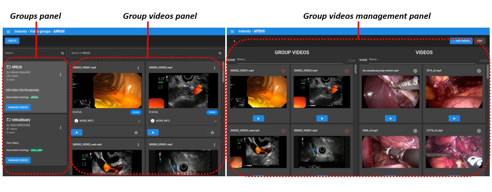

# Indexity

## Description

**Indexity** is a web-based tool designed for medical video annotation in surgical data science projects.
The technical report can be found [here](https://arxiv.org/abs/2306.14780).




## Disclaimer

This application was developed by
**Ircad France/Africa** and **IHU Strasbourg** between 2017 and 2020 within the CONDOR project.

**Indexity** is **not maintained** and this code base
is provided for archive purposes only.

## How to run Indexity

### Before starting

- Install [Docker](https://docs.docker.com/install/linux/docker-ce/ubuntu/)
  and [docker-compose](https://docs.docker.com/compose/install/)

### Run the stack locally

Run docker compose

```bash
docker-compose up
```

The API will be available on http://localhost:8082/, UI on http://localhost:8083/ and admin interface on http://localhost:8085/.

Default admin user is `admin@indexity.local` with password `indexity-password` (to be changed).

### License

Indexity is publicly available under the BSD3-Clause open source license.

### Citation

If you use Indexity in your research, please use the following BibTeX entry.

```BibTeX
@misc{mazellier2023indexity,
      title={INDEXITY: a web-based collaborative tool for medical video annotation},
      author={Jean-Paul Mazellier and Méline Bour-Lang and Sabrina Bourouis and Johan Moreau and Aimable Muzuri and Olivier Schweitzer and Aslan Vatsaev and Julien Waechter and Emilie Wernert and Frederic Woelffel and Alexandre Hostettler and Nicolas Padoy and Flavien Bridault},
      year={2023},
      eprint={2306.14780},
      archivePrefix={arXiv},
      primaryClass={cs.CV}
}
```
