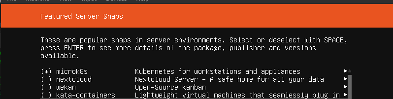

# Indexity cluster infrastructure requirements

**Minimal number of nodes: 3**

**Minimal** specs for each node server:

- OS: Ubuntu-Server 18.04
- Specs:
    - SSD: 50 GB
    - RAM: 16GB
    - CPUS: 8 Cores

- All nodes must be on the same subnet and be able to communicate with each other
- the swap on all nodes must be disabled: `sudo swapoff -a`

#### Snap Add-ons to preinstall during OS installation

- microk8s

#### Packages to install on each node

- `apt-get install -y nfs-common`

# Storage

The cluster uses an NFS server to store DataBase files, DB backup files, as well as Videos/Image files.

#### Clean NFS Mounts

If you want to configure a new NFS mount:

The NFS server's IP must be discoverable on Cluster's subnet with the following server configuration in `/etc/exports`

- Production storage:
    - `/[SOME_PATH]/indexity_prod/ [SOME_SERVER_IP]/24(rw,async,no_subtree_check,no_root_squash)`
- Dev env storage:
    - `/[SOME_PATH]/indexity_dev/ [SOME_SERVER_IP]/24(rw,async,no_subtree_check,no_root_squash)`

#### Read write rights:

The `indexity_prod` and `indexity_dev` folders must have the `chmod 777` applied to them.

#### Disk sizes:

- dev: 200GB
- prod: as much as possible to store all videos needed (as well as rescaled videos)
