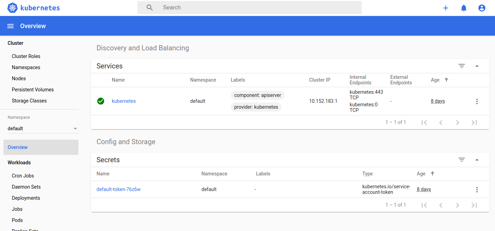

# Indexity Kubernetes cluster setup

Before starting please read the [cluster node requirements](CLUSTER_NODE_REQUIREMENTS.md).

## Infrastructure overview


## Bootstrap a Kubernetes Cluster

`sudo usermod -a -G microk8s $USER`

Logout and login again

`microk8s.enable dns ingress dashboard`

This will setup the server as main Kubernetes node

#### Restart the cluster

```shell script
microk8s.stop && microk8s.start
```

## Managing the cluster remotely

### Install kubectl on your local machine

Install `kubectl` on your local
machine ([Docs](https://v1-13.docs.kubernetes.io/docs/tasks/tools/install-kubectl/#install-kubectl)):

```shell script 
sudo apt-get update && sudo apt-get install -y apt-transport-https
curl -s https://packages.cloud.google.com/apt/doc/apt-key.gpg | sudo apt-key add -
echo "deb https://apt.kubernetes.io/ kubernetes-xenial main" | sudo tee -a /etc/apt/sources.list.d/kubernetes.list
sudo apt-get update
sudo apt-get install -y kubectl
```

Or with snap:

`sudo snap install kubectl --classic`

### Get cluster config file

To manage the Kubernetes Cluster remotely with `kubectl` we need to get the current cluster configuration

On the **main node server** execute the following:

`microk8s.kubectl config view --raw`

Copy the output and save it to **your local** machine in `~/.kube/config` file

Don't forget to change the server's IP.

Test the connection to your cluster:

`kubectl get nodes`

It should display the current nodes in the cluster:


You can now manage your cluster remotely from your local machine

## Accessing the Kubernetes dashboard

### Auth token

To connect to the dashboard we need to get the auth token first (you can do it from local machine if you configured
kubectl correctly in the previous step):

`token=$(kubectl -n kube-system get secret | grep default-token | cut -d " " -f1) && kubectl -n kube-system describe secret $token
`

Copy the auth token and keep it secret.

#### Start proxying the cluster to your local machine:

`kubectl proxy`

#### Access the dashboard

Kubernetes dashboard will be available at:
`http://localhost:8001/api/v1/namespaces/kube-system/services/https:kubernetes-dashboard:/proxy/#/overview`

Connect with your `auth token`:


The dashboard:



## Install HELM V3

For HELM installation follow the documentation: https://helm.sh/docs/intro/install/
