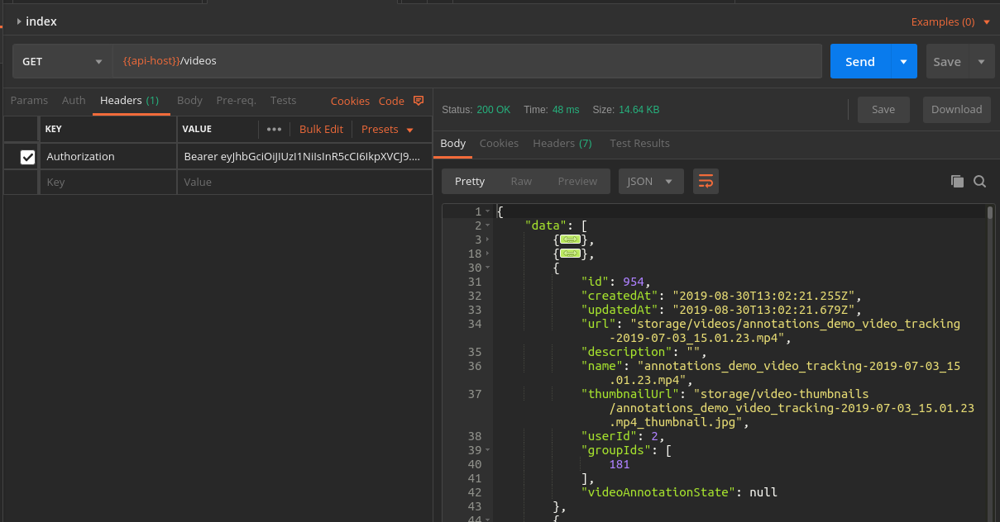

# Indexity Annotations Platform

## Run the stack locally

Run docker compose

```bash
docker-compose up --build
```

The UI will be available on http://localhost:8083

# API Authorization process

## Get your auth token

(Use postman to make requests: https://www.getpostman.com/)

To get an auth token you must make an HTTP POST request to the endpoint `/auth/login` with `email` & `password` as
payload.

*(Read on HTTP requests here: https://www.ntu.edu.sg/home/ehchua/programming/webprogramming/HTTP_Basics.html
)*

Example curl:

```
curl -X POST \
  http://indexity.local/auth/login \
  -H 'Content-Type: application/json' \
  -d '{
	"email": "your@email.com",
	"password": "your_password"
}'
```

## Making authenticated requests

To make authenticated requests add `Authorization/Bearer` header to each of your requests.

Example curl:

```bash

curl -X GET \
  http://indexity.local/videos \
  -H 'Authorization: Bearer YOUR_TOKEN_HERE'

```

Example Postman:



## Local development

Install dependencies

```bash
npm i
```

Start the api locally

```bash
docker-compose up db api redis
```

Start development server

```bash
npm run ng s
```
